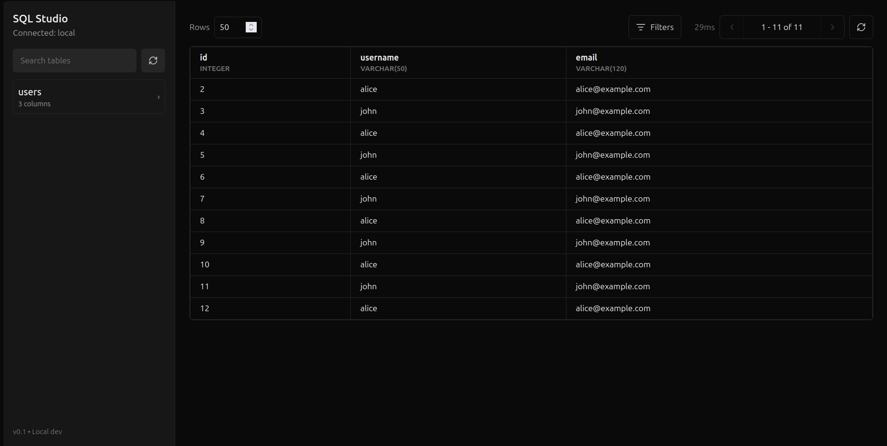

# sqlalchemy-studio

FastAPI studio for inspecting and querying SQLAlchemy databases.

## Installation

Install from PyPI:

```bash
pip install sqlalchemy-studio
```

Or install the latest version from GitHub:

```bash
pip install --upgrade git+https://github.com/coderxuz/sqlalchemy-studio.git@main#subdirectory=sqlalchemy-studio-backend
```

## Usage

Create a normal SQLAlchemy engine and declarative base, then pass them to `Studio`.

```python
from sqlalchemy import Integer, String, create_engine
from sqlalchemy.orm import DeclarativeBase, Mapped, Session, mapped_column

from sqlalchemy_studio import Studio


class Base(DeclarativeBase):
    pass


class User(Base):
    __tablename__ = "users"

    id: Mapped[int] = mapped_column(Integer, primary_key=True, autoincrement=True)
    username: Mapped[str] = mapped_column(String(50), nullable=False)
    email: Mapped[str] = mapped_column(String(120), nullable=False)


engine = create_engine("sqlite:///app.db")


def seed_data() -> None:
    Base.metadata.create_all(engine)

    with Session(engine) as session:
        if session.query(User).count() == 0:
            session.add_all(
                [
                    User(username="john", email="john@example.com"),
                    User(username="alice", email="alice@example.com"),
                ]
            )
            session.commit()


if __name__ == "__main__":
    seed_data()
    Studio(engine=engine, base=Base).run(port=7000)
```

Run the script:

```bash
python app.py
```

Open `http://localhost:7000` in your browser.


